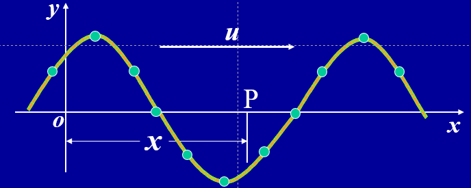
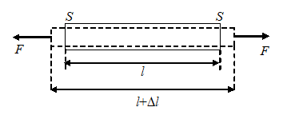
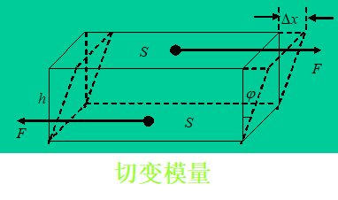
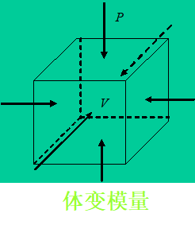
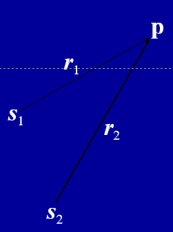

# 波

## 机械波

### 产生机械波的条件

1. ==波源==——**产生持续振动的质点**
2. ==弹性介质==——**传递振动状态的介质**

**在波的传播过程中，介质中的质点它们==在各自的平衡位置附近振动==；传播的是==波源的振动状态==**

### 机械波分类

#### 横波

波源振动方向与波的传播方向垂直的波

传播横波介质：**介质的切向应变**。固体可以传递横波，==气体不能传播横波==。

#### 纵波

波源振动方向与波的传播方向共线的波

传播纵波的介质：**介质的弹性应变**。气体，液体，固体都可以传递纵波。

### 简谐波

#### 基础概念

* ==周期==T：传递一个完整波所需的时间，也是介质质元完成一次全振动的时间。波的周期完全由==波源(周期)==确定。
  $$
  \nu=\frac{1}{T}\\\omega=\frac{2\pi}{T}
  $$

* 角频率$\nu$

* 频率$\omega$

* ==波长==$\lambda$​：一个周期内波动传播的距离。它由==波源==和==介质==共同决定。
  $$
  \tilde k=\frac{1}{\lambda}\\k=\frac{2\pi}{\lambda}
  $$

* 波数$\tilde k$

* 波矢k

* ==波速==u​：单位时间内波传播的距离
  $$
  u=\frac{\lambda}{T}\\u=\nu\lambda
  $$

#### 运动学方程

##### 数学表达式

$$
y=Acos(\omega (t\mp\frac{x}{u})+\phi_0)
$$
==波沿x轴正向传播取-，沿x轴负向传播取+，$\phi_0$代表原点的初相==

考虑到$\omega=\frac{2\pi}{T}$,$u=\frac{\lambda}{T}$,上式还可以写作
$$
y=Acos(2\pi (\frac{t}{T}\mp\frac{x}{\lambda})+\phi_0)\\y=Acos(\omega t\mp\frac{2\pi}{\lambda}x+\phi_0)\\y=Acos(\omega t\mp\frac{\omega}{u}x+\phi_0)
$$

##### 振动方程推导波的方程

$$
y(t)=Acos(\omega t+\phi_0)\\y(x,t)=Acos(\omega(t\pm\frac{x}{u})+\phi_0)
$$

超前落后法：==超前取正，落后取负（已知振动方程的点与原点比较）==$\phi_0$​代表原点初相位

### 动力学方程

#### 微振动方程

$$
\frac{\partial^2 y}{\partial t^2}-a^2\frac{\partial^2y}{\partial x^2}=0\\a=u
$$

其中u为波速

#### 影响因素

$$
绳的微振动横波:\qquad a=\sqrt{\frac{T}{\rho}}\qquad (T为绳的张力)\\杆的纵向微振动波:\qquad a=\sqrt{\frac{Y}{\rho}}\qquad (Y为杨氏弹性模量)\\杆的横向微振动波:\qquad a=\sqrt{\frac{G}{\rho}}\qquad (G为切变弹性模量)\\声音在空气中传播:\qquad a=\sqrt{\frac{B}{\rho}}\qquad (B为体变模量)\\真空中的电磁波\qquad a=\sqrt{\frac{1}{\xi_0\mu_0}}\qquad (\xi_0为真空介电常数,\mu_0为真空磁导率)
$$

[Y](####杨氏模量)

[G](####切变模量)

[B](####体变模量)

#### 杨氏模量

$$
\frac{F}{S}=Y\frac{\Delta l}{l}
$$
比例系数Y由材料的弹性决定，称为杨氏模量 

#### 切变模量

$$
\frac{F}{S}=G\phi=G\frac{\Delta x}{h}(\phi极小近似)
$$
比例系数G由材料的切变弹性决定，称为切变模量 

#### 体变模量

$$
\Delta P=-B\frac{\Delta V}{V}\qquad式中负号表示当\Delta P>0时，\Delta V <0 
$$

### 能量

#### 能量密度

==单位体积中波的能量==（$\xi$）

##### 势能

$$
dW_p=\frac{1}{2}k(dy)^2\\dW_p=\frac{1}{2}\rho dV \omega^2A^2sin^2(w(t-\frac{x}{u}))
$$

由一式结合[杨氏模量](####杨氏模量)可推出二式

##### 动能

$$
dW_k=\frac{1}{2}\rho dV \omega^2A^2sin^2(w(t-\frac{x}{u}))
$$

##### 质元能量

$$
dW=dW_p+dW_k=\rho dV \omega^2A^2sin^2(w(t-\frac{x}{u}))
$$

1. ==任意时刻质元动能和势能都相等==

2. ==质元的总能量随时间作周期性的变化==。在波动中, 随着振动在介质中的传播, 能量也从介质的一部分传到另一部分, 所以,波动是能量传播的一种方式。

3. 能量密度(单位体积中波的能量)为:
   $$
   \xi=\rho \omega^2A^2sin^2(w(t-\frac{x}{u}))\\\bar \xi=\frac{1}{T}\int_0^T\xi dt=\frac{1}{2}\rho \omega^2A^2
   $$
   ==$\xi$为能量密度==

   ==$\bar \xi$为平均能量密度==

#### 能流密度

​       ==单位时间内，通过垂直于波动传播方向的单位面积的能量，称为能流密度。==（I）
$$
I=\bar \xi u=\frac{1}{2}\rho u\omega^2A^2
$$

## 声波

### 声速

$u=\sqrt\frac{T}{\rho}$[公式](####切变模量)

计算得常温空气声速：331m/s

### 声强

==声波的波强叫做声强==，单位时间通过一定面积的声波能量，称为==声功率==（L）。[波强](####能流密度)
$$
L=10lg\frac{I}{I_0}\qquad(I_0=10^{-12}W/m^2)\qquad[分贝, decibel]
$$

### 声压

**流体中的声波是压强波**,$\Delta p$记作声压
$$
\Delta p=p-p_0\\\Delta p=\rho uv
$$

## 波的叠加

### 波的叠加原理

==**每列波的传播特性不因其它波的存在而改变。任一点的振动为各个波单独在该点产生的振动的合成。**==这一规律称为波的独立传播原理或波的叠加原理。

### 波的干涉

**两列波在相遇区域会出现有些地方的振动始终加强，而另一些的振动始终减弱的稳定分布，**这种现象称为波的干涉。

#### 条件

1. **振动方向相同**
2. **频率相同**
3. **相差恒定**

#### 叠加公式

$$
y_1(t)=A_1cos(\omega t-kr_1+\phi_1)\quad p点振动方程\\y_2(t)=A_2cos(\omega t-kr_2+\phi_2)\quad p点振动方程\\y=Acos(\omega t+\phi)\quad p点合振动方程\\A=\sqrt{A_1^2+A_2^2+2A_1A_2cos\Delta\phi}\\I=I_1+I_2+2\sqrt{I_1I_2}cos\Delta\phi\\\Delta\phi=\phi_2-\phi_1-k(r_2-r_1)\\tg\phi=\frac{A_1sin(\phi_1-kr_1)+A_2sin(\phi_2-kr_2)}{A_1cos(\phi_1-kr_1)+A_2cos(\phi_2-kr_2)}
$$
